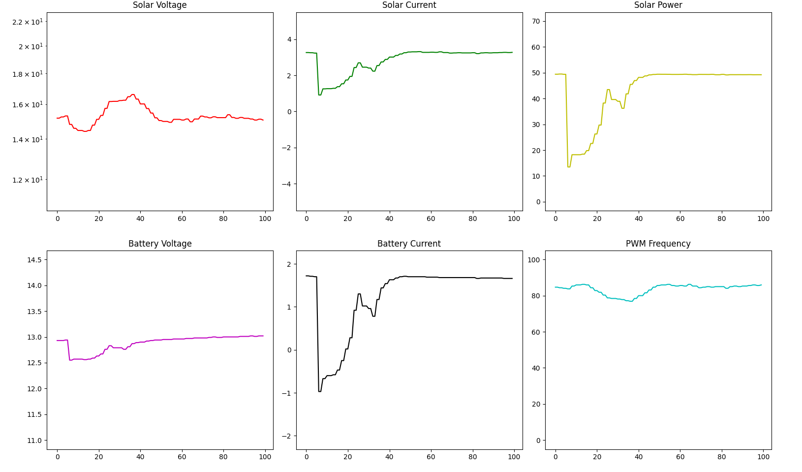

# Libre Solar Data Plotter

A basic data plotter in python using Matpotlib that receives serial data (thingset protocol) from a [Libre Solar](https://libre.solar/) solar charge controller.

This script was tested with the [MPPT 1210 HUS - Battery & USB Charger](https://libre.solar/hardware/mppt-1210-hus.html)

